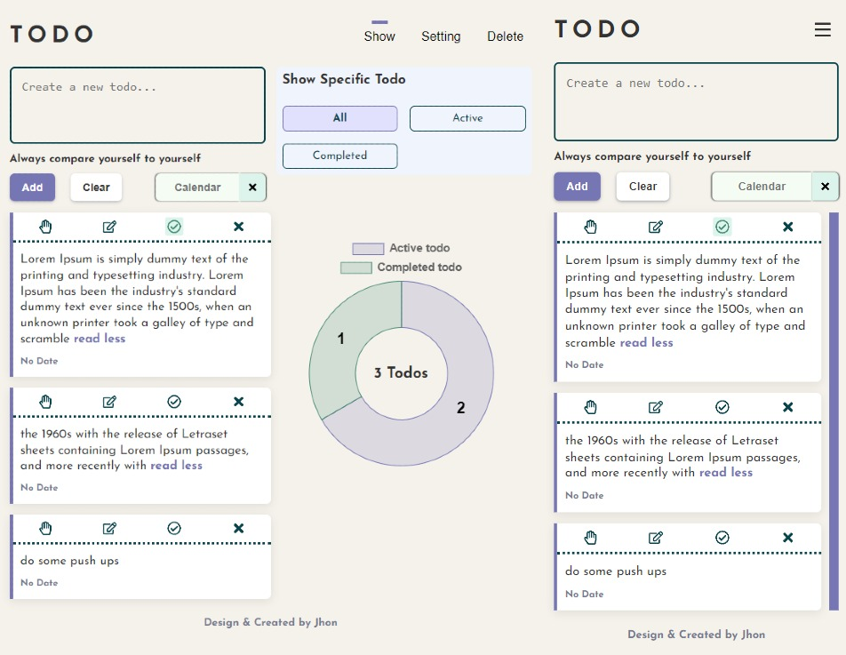

# Frontend Mentor - Todo 2.0

| mobile & desktop layout                  | mobile menu modal                  |
| ---------------------------------------- | ---------------------------------- |
|  |  |

This is my solution to the [Manage landing page challenge on Frontend Mentor](https://www.frontendmentor.io/challenges/todo-app-Su1_KokOW/hub/todo-app-1LV3kQB5Gf)

- [Solution URL](https://www.frontendmentor.io/challenges/todo-app-Su1_KokOW/hub/todo-app-1LV3kQB5Gf)
- [Live Site URL](https://jhon-okayda-todo-app.netlify.app/)

## Built with

- Mobile-first (Layout)
- BEM
- SASS/SCSS
- SCSS Modules
- React-JS
- framer-motion
- react-chartjs-2
- flatpickr
- react-hot-toast
- react-content-loader
- react-read-more-read-less

## Author

- Created & Design by - okayda-jhon
